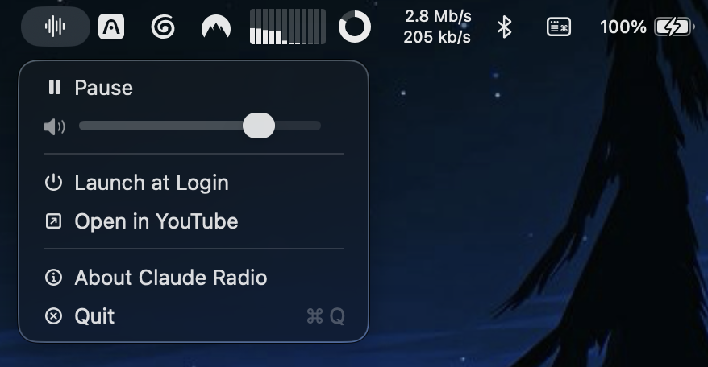

# Claude Radio



A lightweight macOS menu bar app that plays Anthropic's official 24/7 "Claude FM"
YouTube livestream, "music for thinking and building," with one click. No browser
tab, no Dock icon, no window. Just press play and keep working.

## Features

- Lives entirely in the menu bar. No Dock icon, no main window.
- Left-click the icon to play or pause. Right-click for the full menu.
- Volume slider in the dropdown, or scroll over the icon to adjust it.
- Auto-reconnects with exponential backoff if the stream drops or stalls.
- Launch at login, toggled from the menu.
- Hardware media key support (play/pause).
- "Open in YouTube" fallback if you'd rather watch than just listen.

## Requirements

- macOS 14 (Sonoma) or later
- Xcode 15 or later, to build from source
- [XcodeGen](https://github.com/yonaskolb/XcodeGen), install with `brew install xcodegen`

## Building from source

There are no packaged releases yet. To build and run:

```bash
git clone https://github.com/aarontbt/claude-radio.git
cd claude-radio
make run
```

`make run` regenerates the Xcode project, builds the app and launches it. Other
useful targets:

```bash
make build    # build only
make test     # run the unit tests
make clean    # remove build artifacts and the generated .xcodeproj
```

`make build` puts the app at `build/Debug/ClaudeRadio.app`. Launch it with
`open build/Debug/ClaudeRadio.app`, or drag it into `/Applications`. `make run`
does the build and opens it for you in one step.

## How it works

Claude Radio plays the stream through an off-screen `WKWebView` running the
official YouTube IFrame Player API, the same embed YouTube provides for any
website. It does not scrape or extract raw stream URLs. See `AGENTS.md` for the
full architecture writeup.

## License

MIT. See `LICENSE`.
Built by [aarontbt](https://github.com/aarontbt).
